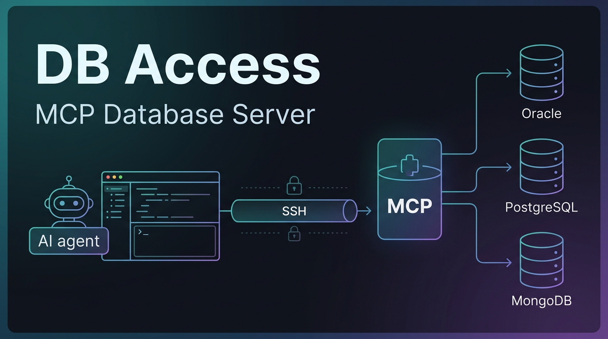

<div align="center">



# 📦 DB Access — MCP Database Server


</div>

> Internal [Model Context Protocol (MCP)](https://modelcontextprotocol.io/) server cho phép AI agents / IDEs truy vấn **Oracle**, **PostgreSQL** và **MongoDB** databases từ xa, an toàn.

## 🌟 Highlights

- 🔌 **Một server, nhiều DB** — Oracle, PostgreSQL và MongoDB sau *một* endpoint MCP; tool `sql_*` tự chọn driver theo `db_name`, thêm DB quan hệ mới không phát sinh tool.
- 👥 **Multi-tenant** — mỗi agent/IDE là một *source* với API key riêng, phân quyền `read` / `write` / `script` **theo từng database**.
- 🛡️ **An toàn mặc định** — chặn DDL, shadow-preview + confirmation token 2 bước cho mọi thao tác ghi (`UPDATE`/`DELETE`/script).
- 🔐 **SSH tunnel tích hợp** — khai `ssh:` trong config, server tự mở & giữ tunnel (không cần `ssh -L` thủ công hay systemd unit riêng).
- 📡 **Đa transport** — Stdio (local), Streamable HTTP, SSE (legacy) → dùng được với Claude Code, Antigravity, Codex, Cursor/Windsurf…
- 🗂️ **Config tập trung + hot-reload** — `config.yaml` + `${ENV}` secrets; thêm/sửa source qua CLI, không cần restart.

## ℹ️ Tổng quan

```
┌──────────────────────────────────────────────────────────────────┐
│                        DB Access Server                          │
│                                                                  │
│  ┌──────────┐   ┌──────────────┐   ┌───────────────────────────┐│
│  │ Stdio    │   │ Streamable   │   │ Legacy SSE                ││
│  │ Transport│   │ HTTP (POST /)│   │ (GET /sse + POST /messages││
│  └────┬─────┘   └──────┬───────┘   └──────────┬────────────────┘│
│       │                │                       │                 │
│       └────────────────┴───────────────────────┘                 │
│                        │                                         │
│              ┌─────────┴──────────┐                              │
│              │   Tool Registry    │                              │
│              │  (11 MCP Tools)    │                              │

│              └─────────┬──────────┘                              │
│       ┌────────────────┼────────────────┐                        │
│  ┌────┴─────┐    ┌─────┴──────┐   ┌────┴──────┐                 │
│  │ Config   │  │ Oracle │ PostgreSQL │ MongoDB │                 │
│  │ Loader   │  │ Driver │   Driver   │ Driver  │                 │
│  │(yaml+ssh)│  │(oracledb)│   (pg)    │(mongodb)│                 │
│                  └─────┬──────┘   └────┬──────┘                  │
│                        │               │                         │
│              ┌─────────┴──────────┐    │                         │
│              │   Safety Layer     │    │                         │
│              │ • SQL Parser       │    │                         │
│              │ • Token Manager    │    │                         │
│              │ • Schema Enforcer  │    │                         │
│              └────────────────────┘    │                         │
└──────────────────────────────────────────────────────────────────┘
         │                                      │
    ┌────┴──────────┐  ┌──────────────┐  ┌────────┴────────┐
    │ Oracle DB(s)  │  │ PostgreSQL(s)│  │  MongoDB(s)     │
    └───────────────┘  └──────────────┘  └─────────────────┘
```

### Đặc điểm nổi bật

| Tính năng | Mô tả |
|---|---|
| 🗂️ **Config tập trung (`config.yaml`)** | Tất cả database connections khai báo trong `config.yaml`, secrets tham chiếu qua `${ENV_VAR}` và resolve từ environment lúc load |
| 👥 **Multi-Source / Per-DB Capabilities** | Mỗi consumer (agent/IDE) là một **source** riêng với **API key riêng**, được cấp quyền `read`/`write`/`script` theo từng database |
| 🛡️ **Safety Gates** | Chặn DDL, yêu cầu confirmation token cho write operations (INSERT/UPDATE/DELETE) |
| 🔑 **API Key Auth (header-only)** | Xác thực bằng `x-api-key` HTTP header **bắt buộc** khi expose qua HTTP — query string không còn được chấp nhận |
| 🔐 **SSH Tunnel Tích Hợp** | Database có thể khai báo `ssh:` block — server tự mở/quản lý SSH tunnel (qua `ssh2`), không cần systemd tunnel riêng |
| 📡 **Multi-Transport** | Hỗ trợ Stdio (local), Streamable HTTP (modern), và SSE (legacy) |
| 📋 **Schema Enforcer** | Bắt buộc schema prefix trong mọi truy vấn SQL (`SCHEMA.TABLE`) |
| 👁️ **Shadow Preview** | Tự động preview rows bị ảnh hưởng trước khi thực thi UPDATE/DELETE; từ chối đoán khi không chắc chắn |

### ✍️ Tác giả

Xây dựng & duy trì bởi [**@VIethoangnguyenle**](https://github.com/VIethoangnguyenle) (hoangnlv). Là internal tool — góp ý/issue xin gửi qua [repo trên GitHub](https://github.com/VIethoangnguyenle/Db-Access).

---

## 🚀 Quick Start

### 1. Cài đặt dependencies

```bash
npm install
```

### 2. Cấu hình `config.yaml` + secrets

Database connections, sources và capabilities được khai báo trong **`config.yaml`** (không còn dùng auto-discovery `.env` như trước). Copy file mẫu:

```bash
cp config.example.yaml config.yaml
cp .env.example .env
```

`config.yaml` khai báo `databases:` và `sources:`. Secrets (`user`, `password`, `apiKey`, ...) tham chiếu tới environment variable qua cú pháp `${ENV_VAR}` — giá trị thật được resolve từ `.env` lúc server khởi động:

```yaml
databases:
  oracle_prod:
    type: oracle
    host: 127.0.0.1
    port: 1521
    service: XEPDB1
    user: ${PROD_USER}
    password: ${PROD_PASS}

sources:
  agent_a:
    apiKey: ${KEY_A}
    access:
      oracle_prod:
        capabilities: [read]
        description: "DB bán hàng: đơn hàng, khách hàng (chỉ đọc)"
      # mongo_logs: [read]   # dạng rút gọn (chỉ capabilities) vẫn dùng được
```

Chỉnh sửa `.env` để điền các giá trị `${ENV_VAR}` được tham chiếu ở trên, ví dụ:

```env
CONFIG_PATH=./config.yaml
PROD_USER=system
PROD_PASS=your_password_here
KEY_A=replace-with-strong-random-key
```

> **Field reference (per database):** `type` (`oracle` | `postgres` | `mongo`), `host`, `port`, `service` (bắt buộc nếu `type: oracle`) hoặc `database` (bắt buộc nếu `type: postgres` hoặc `type: mongo`), `user`, `password`, và `ssh` (optional — xem mục [SSH Tunnel Tích Hợp](#ssh-tunnel-tích-hợp)).
>
> **Field reference (per source):** `apiKey`, và `access` — map mỗi DB mà source được dùng. Mỗi entry có 2 dạng:
> - **Rút gọn:** `<dbName>: [capabilities]`
> - **Đầy đủ:** `<dbName>: { capabilities: [...], description: "..." }`
>
> `capabilities` ∈ `read` / `write` / `script`. `description` (optional) được trả về trong `list_databases` để **agent biết mỗi DB dùng làm gì** và chọn đúng DB. Mỗi source chỉ khai những DB nó cần — không thấy được DB ngoài `access`.
>
> Đường dẫn file config đọc từ env var `CONFIG_PATH` (default: `./config.yaml`).

### 3. Chạy server

**Development mode (với hot-reload):**
```bash
npm run dev
```

**Production mode:**
```bash
npm run build
npm start
```

**Stdio mode (cho local AI clients):**
```bash
npm start -- --stdio
```

---

## Quản lý source (CLI) + Hot-reload

**Thêm/liệt kê source bằng CLI** (khỏi sửa YAML tay — tự sinh apiKey, ghi `config.yaml` + `.env`):

```bash
# Liệt kê các source hiện có
npm run source -- list

# Thêm source mới: tự sinh apiKey, ghi KEY_<NAME> vào .env và source vào config.yaml
npm run source -- add project_b \
  --db oracle_sales:read,write --desc oracle_sales="DB bán hàng" \
  --db mongo_logs:read
```

CLI kiểm tra: DB phải tồn tại, capability hợp lệ, tên source chưa trùng; rồi in ra apiKey để bạn đưa cho dự án (header `x-api-key`). Lưu ý: `config.yaml` được ghi lại bằng js-yaml nên **comment trong file sẽ bị chuẩn hoá/mất** — nếu cần giữ comment, sửa tay thay vì dùng CLI.

**Hot-reload:** server theo dõi `config.yaml`; khi file đổi, nó **đọc lại `.env` + nạp lại config + dựng lại bảng API key** mà không cần restart. Nếu config mới lỗi (sai cú pháp/validate), server **giữ nguyên config cũ** và ghi log lỗi (không sập). Session HTTP mới dùng quyền mới; session đang mở giữ snapshot cũ cho tới khi kết nối lại.

> Vì hot-reload đọc lại `.env`, thêm source bằng CLI (ghi `.env` trước, `config.yaml` sau) sẽ được server đang chạy tự nhận — không cần restart.

---

## SSH Tunnel Tích Hợp

Khi một database chỉ truy cập được qua một bastion/jump host, khai báo block `ssh:` ngay trong entry database của `config.yaml` — server tự mở và quản lý tunnel (qua thư viện `ssh2`), không cần chạy systemd tunnel riêng (`mcp-db-tunnel.service`) nữa:

```yaml
databases:
  oracle_internal:
    type: oracle
    host: xx.xxx.xx.xx      # host/port của DB, nhìn từ phía bastion
    port: 1521
    service: XEPDB1
    user: ${PROD_USER}
    password: ${PROD_PASS}
    ssh:
      host: xx.xxx.xx.xx     # bastion host
      port: 22                 # optional, default 22
      user: ssh-user
      privateKey: ${SSH_KEY_PATH}   # optional — xem 2 chế độ auth bên dưới
      passphrase: ${SSH_KEY_PASSPHRASE}  # optional, chỉ dùng với privateKey
```

`host:port` của DB là địa chỉ nhìn **từ phía bastion** (đầu xa của port-forward), không phải từ máy chạy server. Tunnel được cache theo tên database — chỉ mở một lần cho tới khi server restart hoặc tunnel bị đóng.

> **Lưu ý:** `xx.xxx.xx.xx` trong các ví dụ là placeholder — thay bằng địa chỉ/hostname thật của bạn.

### Hai chế độ xác thực SSH

`privateKey` là **optional**, quyết định cách server mở tunnel:

1. **Có `privateKey`** → server dùng thư viện `ssh2` (thuần JS, vòng đời sạch). `privateKey` là **đường dẫn** tới file key (hỗ trợ `~`), tham chiếu qua `${ENV_VAR}` để không hard-code. Lưu ý: `ssh2` **không** đọc `~/.ssh/config`.

2. **Không khai `privateKey`** → server spawn chính **`ssh` của hệ thống** (`ssh -N -L ...`), tận dụng toàn bộ `~/.ssh/config`, default key và ssh-agent sẵn có của máy. Đây là lựa chọn khi *"máy đã cấu hình SSH auth"* — tương đương lệnh bạn vẫn chạy tay. Ví dụ, lệnh:

   ```bash
   ssh -N -L 18789:127.0.0.1:18789 ssh-user@xx.xxx.xx.xx
   ```

   tương ứng config (không cần `privateKey`):

   ```yaml
   databases:
     mydb:
       type: oracle
       host: 127.0.0.1     # nhìn từ phía bastion
       port: 18789
       service: XEPDB1
       user: ${DB_USER}
       password: ${DB_PASS}
       ssh:
         host: xx.xxx.xx.xx
         user: ssh-user
   ```

   Server tự chọn local port trống và spawn `ssh -N -L 127.0.0.1:<auto>:127.0.0.1:18789 ssh-user@xx.xxx.xx.xx` (kèm `BatchMode=yes`, `ExitOnForwardFailure=yes`), kill tiến trình `ssh` khi tunnel đóng / server tắt.

---

## Migration: từ `.env` Auto-Discovery sang `config.yaml`

Phiên bản cũ tự động quét `.env` theo convention `{PREFIX}_URL/USERNAME/PASSWORD` để phát hiện database, và dùng một `API_KEY` chung cho mọi client. Phiên bản mới yêu cầu khai báo rõ trong `config.yaml`, với API key riêng theo từng source và capability theo từng DB. Các bước chuyển đổi:

### 1. Mỗi `{PREFIX}_URL/USERNAME/PASSWORD` cũ → một entry trong `databases:`

**Oracle** — tách `host`, `port`, `service` ra khỏi JDBC URL `jdbc:oracle:thin:@host:port/SERVICE`:

```env
# Cũ (.env)
MYDB_URL=jdbc:oracle:thin:@localhost:1521/XEPDB1
MYDB_USERNAME=system
MYDB_PASSWORD=your_password_here
```

```yaml
# Mới (config.yaml)
databases:
  mydb:
    type: oracle
    host: localhost
    port: 1521
    service: XEPDB1
    user: ${MYDB_USER}
    password: ${MYDB_PASS}
```

**MongoDB** — tách `host`, `port`, `database` ra khỏi URL `mongodb://host:port/database`:

```env
# Cũ (.env)
MONGOTXN_URL=mongodb://localhost:27017/transaction_db
MONGOTXN_USERNAME=admin
MONGOTXN_PASSWORD=your_password_here
```

```yaml
# Mới (config.yaml)
databases:
  mongotxn:
    type: mongo
    host: localhost
    port: 27017
    database: transaction_db
    user: ${MONGOTXN_USER}
    password: ${MONGOTXN_PASS}
```

> Tên key trong `databases:` (ví dụ `mydb`, `mongotxn`) chính là tên database client sẽ thấy qua `list_databases` — tương đương `PREFIX` (viết thường) ở model cũ.

### 2. Khai báo `sources:` thay cho `API_KEY` chung

Mỗi consumer (agent, IDE, script...) cần một entry riêng trong `sources:`, với API key riêng và quyền truy cập rõ ràng theo từng DB:

```yaml
sources:
  agent_a:
    apiKey: ${KEY_A}
    access:
      mydb: [read]
      mongotxn: [read, write]
```

### 3. Đưa secrets vào `.env`, tham chiếu bằng `${ENV}` trong `config.yaml`

```env
MYDB_USER=system
MYDB_PASS=your_password_here
MONGOTXN_USER=admin
MONGOTXN_PASS=your_password_here
KEY_A=replace-with-strong-random-key
```

`config.yaml` chỉ chứa cấu trúc + tên biến môi trường (`${VAR}`) — không chứa secret thật. Giá trị thật resolve từ `.env`/environment lúc server load config (qua `CONFIG_PATH`).

### 4. DB cần SSH tunnel: dùng `ssh:` block thay cho systemd tunnel

Nếu DB trước đây cần một `mcp-db-tunnel.service` (SSH port-forward) để truy cập, thêm `ssh:` block vào entry database tương ứng (xem [SSH Tunnel Tích Hợp](#ssh-tunnel-tích-hợp)) thay vì duy trì service tunnel riêng. Server sẽ tự mở tunnel khi cần.

---

## Security Recommendation

- **Least-privilege DB accounts**: tạo user DB riêng cho server với quyền tối thiểu cần thiết (tránh dùng account admin/system); kết hợp với capability `read`/`write` ở tầng source để có 2 lớp kiểm soát.
- **Hạn chế capability `script`**: chỉ cấp `script` (PL/SQL execution) cho source nào thực sự cần chạy script phức tạp — đây là capability rủi ro cao nhất, nên audit định kỳ source nào đang có quyền này.
- **API key riêng theo source, xoay định kỳ**: không tái sử dụng một key cho nhiều consumer; thu hẹp `access` của từng source về đúng những DB nó cần.

---

## Cấu hình MCP Client

> **Auth qua header:** server chấp nhận key qua `x-api-key` **hoặc** `Authorization: Bearer <key>` (cùng một key). Antigravity/Claude Code dùng `x-api-key`; Codex (HTTP) chỉ set được bearer token nên dùng `Authorization: Bearer`.

### Tự động bằng script (Antigravity + Claude Code + Codex)

```bash
scripts/setup-client.sh --url http://<host>:3000/mcp --key <apiKey> \
  [--name db-access] [--tools antigravity,claude,codex] [--key-env DB_ACCESS_API_KEY]
```

Script sẽ: chạy `claude mcp add` (x-api-key), merge `~/.gemini/antigravity/mcp_config.json` (serverUrl + x-api-key), và `codex mcp add --url ... --bearer-token-env-var` (Codex đọc token từ env var — script nhắc bạn `export <KEY_ENV>=<key>`). Bỏ qua tool nào không cài. Dưới đây là cấu hình thủ công tương ứng:

### Antigravity / Gemini CLI (Streamable HTTP — recommended)

```json
{
  "mcpServers": {
    "db-access": {
      "serverUrl": "http://<YOUR_IP>:3000/mcp",
      "headers": {
        "x-api-key": "your-secure-api-key-here"
      }
    }
  }
}
```

### Antigravity / Claude Desktop (Stdio — local)

Ở chế độ Stdio, server vẫn đọc `databases:`/`sources:` từ `config.yaml` (qua `CONFIG_PATH`) và secrets từ environment — không truyền connection details qua `env` của client nữa. Vì không có HTTP request nên không dùng `x-api-key`; source được chọn bằng cờ `--source <name>` (hoặc env `MCP_SOURCE`) — nếu `config.yaml` chỉ có **một** source thì có thể bỏ qua, server tự chọn source đó:

```json
{
  "mcpServers": {
    "db-access": {
      "command": "node",
      "args": ["/path/to/db-access/dist/index.js", "--stdio", "--source", "agent_a"],
      "env": {
        "CONFIG_PATH": "/path/to/db-access/config.yaml",
        "PROD_USER": "system",
        "PROD_PASS": "your_password",
        "KEY_A": "replace-with-strong-random-key"
      }
    }
  }
}
```

### Codex (Streamable HTTP — bearer token)

Codex HTTP MCP chỉ set được **bearer token đọc từ một env var**, không set `x-api-key` tùy ý. Server đã hỗ trợ `Authorization: Bearer <key>` nên dùng được:

```bash
codex mcp add db-access --url http://<YOUR_IP>:3000/mcp --bearer-token-env-var DB_ACCESS_API_KEY
# rồi export token để Codex đọc lúc chạy:
export DB_ACCESS_API_KEY='your-secure-api-key-here'   # thêm vào ~/.bashrc / ~/.zshrc
```

Tạo entry trong `~/.codex/config.toml`:
```toml
[mcp_servers.db-access]
url = "http://<YOUR_IP>:3000/mcp"
bearer_token_env_var = "DB_ACCESS_API_KEY"
```

### Cursor / Windsurf (SSE — legacy)

API key **chỉ được chấp nhận qua `x-api-key` header** (query string `?api_key=...` không còn hợp lệ). Với client không hỗ trợ custom headers cho SSE, dùng [SSE Proxy](#sse-proxy-chuyển-sse--stdio-cho-ides-không-hỗ-trợ-sse-natively) bên dưới.

```json
{
  "mcpServers": {
    "db-access": {
      "type": "sse",
      "url": "http://<YOUR_IP>:3000/sse",
      "headers": {
        "x-api-key": "your-secure-api-key-here"
      }
    }
  }
}
```

### SSE Proxy (chuyển SSE → Stdio cho IDEs không hỗ trợ SSE natively)

```json
{
  "mcpServers": {
    "db-access": {
      "command": "node",
      "args": [
        "/path/to/db-access/sse-proxy.mjs",
        "--host", "<YOUR_IP>",
        "--port", "3000",
        "--api-key", "your-secure-api-key-here"
      ]
    }
  }
}
```

> `sse-proxy.mjs` gửi `--api-key` qua **header `x-api-key`** (cả luồng SSE GET lẫn POST messages), khớp với cơ chế auth header-only của server.

---

## Triển khai 2 máy: Máy A (server + tunnel) ↔ Máy B (client từ xa)

Mô hình: **chỉ Máy A kết nối tới DB** (qua SSH tunnel), chạy MCP server. **Máy B kết nối DB *gián tiếp* qua Máy A** — agent trên Máy B chỉ nói chuyện HTTP với MCP server của Máy A, không bao giờ thấy credential DB (chỉ cầm `apiKey`).

```
        ┌─────────────── Máy B (client từ xa) ───────────────┐
        │  Antigravity / Claude / Codex                      │
        │      │  HTTP + x-api-key (hoặc Bearer)             │
        └──────┼──────────────────────────────────────────────┘
               │  http://<MÁY_A_IP>:3000/mcp
        ┌──────▼──────────────── Máy A (máy chính) ───────────┐
        │  MCP server (PORT=3000)                             │
        │      │  SSH tunnel (server tự quản qua `ssh:` block)│
        └──────┼──────────────────────────────────────────────┘
               │  ssh -N -L … bastion → DB
        ┌──────▼──────┐
        │  Database    │
        └──────────────┘
```

### 1. Máy A — `config.yaml` (DB qua SSH tunnel) + chạy server

DB khai `ssh:` block để **server tự mở/giữ tunnel** (không cần `ssh -L` thủ công). Khai **hai source**: `agent_a` cho chính Máy A, `agent_b` cho Máy B — mỗi source một `apiKey` + quyền riêng. **Một source cấp được nhiều DB** (oracle + postgres + mongo); Máy B chỉ mở **một** kết nối MCP là dùng được tất cả DB của nó.

```yaml
# Máy A: config.yaml
databases:
  oracle_prod:
    type: oracle
    host: 127.0.0.1        # nhìn từ phía bastion (đầu xa của tunnel)
    port: 1521
    service: XEPDB1
    user: ${PROD_USER}
    password: ${PROD_PASS}
    ssh:
      host: xx.xxx.xx.xx   # bastion / máy có thể thấy DB
      user: ssh-user
      # privateKey: ~/.ssh/id_rsa   # bỏ trống → server spawn `ssh` hệ thống (dùng ~/.ssh/config + agent)
  pg_analytics:
    type: postgres
    host: 127.0.0.1
    port: 5432
    database: analytics
    user: ${PG_USER}
    password: ${PG_PASS}
  mongo_logs:
    type: mongo
    host: 127.0.0.1
    port: 27017
    database: logs
    user: ${MONGO_USER}
    password: ${MONGO_PASS}

sources:
  agent_a:                 # agent chạy ngay trên Máy A — full quyền
    apiKey: ${KEY_A}
    access:
      oracle_prod:  { capabilities: [read, write, script], description: "DB prod" }
      pg_analytics: { capabilities: [read, write], description: "DB phân tích" }
      mongo_logs:   [read]
  agent_b:                 # agent từ Máy B — NHIỀU DB, quyền siết theo từng DB
    apiKey: ${KEY_B}
    access:
      oracle_prod:  { capabilities: [read],        description: "DB prod (chỉ đọc)" }
      pg_analytics: { capabilities: [read, write], description: "DB phân tích" }
      mongo_logs:   [read]
```

> Với cấu hình trên, agent Máy B gọi `list_databases` chỉ thấy đúng **3 DB** này. Server route theo `db_name`: `sql_*` cho `oracle_prod`/`pg_analytics`, `mongo_*` cho `mongo_logs`. Quyền **per-DB**: `sql_write` trên `oracle_prod` (chỉ `read`) bị từ chối, nhưng trên `pg_analytics` (có `write`) thì chạy được.

```bash
# Máy A: chạy server (lắng nghe 0.0.0.0:3000, endpoint /mcp)
export PROD_USER=system PROD_PASS=... PG_USER=... PG_PASS=... MONGO_USER=... MONGO_PASS=...
export KEY_A=key-cho-A KEY_B=key-cho-B
PORT=3000 CONFIG_PATH=./config.yaml node dist/index.js
# (hoặc dùng systemd unit mcp-db-tools.service)
```

> Nếu bạn đã tự chạy tunnel thủ công (`ssh -N -L 1521:127.0.0.1:1521 ssh-user@xx.xxx.xx.xx`) thì **bỏ `ssh:` block**, đặt `host: 127.0.0.1` + `port: 1521` trỏ thẳng vào local-forward.

**Agent ngay trên Máy A** trỏ về localhost:

```json
{
  "mcpServers": {
    "db-access": {
      "serverUrl": "http://127.0.0.1:3000/mcp",
      "headers": { "x-api-key": "key-cho-A" }
    }
  }
}
```

### 2. Máy B — client trỏ tới Máy A

**Cách 1 — Trực tiếp qua IP Máy A** (mạng nội bộ / VPN cho phép tới cổng 3000):

```json
{
  "mcpServers": {
    "db-access": {
      "serverUrl": "http://<MÁY_A_IP>:3000/mcp",
      "headers": { "x-api-key": "key-cho-B" }
    }
  }
}
```

Hoặc bằng script:

```bash
# trên Máy B
scripts/setup-client.sh --url http://<MÁY_A_IP>:3000/mcp --key key-cho-B
```

**Cách 2 — Không expose cổng 3000: SSH tunnel B → A** (khuyến nghị khi Máy A không nên mở 3000 ra ngoài). Trên Máy B forward 3000 của A về local rồi trỏ client vào `127.0.0.1`:

```bash
# trên Máy B: đưa cổng MCP của Máy A về local
ssh -N -L 3000:127.0.0.1:3000 user@<MÁY_A_IP>
```

```json
{
  "mcpServers": {
    "db-access": {
      "serverUrl": "http://127.0.0.1:3000/mcp",
      "headers": { "x-api-key": "key-cho-B" }
    }
  }
}
```

> **Bảo mật:** server bind `0.0.0.0:3000` nên **luôn** đặt sau firewall/VPN, hoặc dùng **Cách 2** để không phơi cổng 3000. Mỗi máy/agent dùng `apiKey` riêng (`agent_a` vs `agent_b`) để thu hồi hoặc giới hạn quyền độc lập — Máy B chỉ `read` trong ví dụ trên. Xem thêm [Security Recommendation](#security-recommendation).

---

## Available Tools

> **Tool theo thao tác, không theo loại DB:** các tool `sql_*` dùng chung cho **Oracle** và **PostgreSQL** — server tự chọn driver đúng dựa trên `type` của `db_name` lúc gọi tool (xem `src/drivers/relational.ts`). Thêm một relational DB mới (cùng loại) **không phát sinh tool mới**. MongoDB giữ bộ `mongo_*` riêng vì paradigm khác (collection/find thay vì SQL).
>
> **Capability gating:** mỗi tool yêu cầu source phải có capability tương ứng trên database đó (`access: { <dbName>: [...] }` trong `config.yaml`): nhóm *Discovery & Schema* và *Query & Read* cần `read`; nhóm *Write* cần `write`; `sql_execute_script` cần `script`. Thiếu capability → tool call bị từ chối.

### Discovery & Schema

| Tool | Mô tả |
|---|---|
| `list_databases` | Liệt kê các databases mà **source hiện tại** (theo `x-api-key`) được cấp quyền truy cập, kèm `type` và `capabilities` (`read`/`write`/`script`) tương ứng. Gọi đầu tiên để biết databases nào khả dụng. |
| `sql_list_tables` | Liệt kê tất cả tables trong relational database (**Oracle** hoặc **PostgreSQL** — tự chọn driver theo `type` của DB). |
| `sql_get_columns` | Lấy chi tiết columns (tên, kiểu, nullable, comments) của một table (Oracle/PostgreSQL). |
| `sql_get_constraints` | Lấy constraints (PK, FK, Unique) của một table (Oracle/PostgreSQL). |
| `mongo_list_collections` | Liệt kê tất cả collections trong MongoDB database. |
| `mongo_get_schema` | Lấy schema suy luận (document count, sample document) của một collection. |

### Query & Read

| Tool | Mô tả |
|---|---|
| `sql_read` | Thực thi SELECT query trên relational DB (Oracle/PostgreSQL). DML/DDL bị chặn. Oracle **bắt buộc schema prefix**; PostgreSQL thì không (giới hạn 100 rows, cờ `truncated`). |
| `mongo_read` | Thực thi find (SELECT) trên MongoDB. Write operations bị chặn. |

### Write (Two-Step Confirmation)

| Tool | Mô tả |
|---|---|
| `sql_write` | Thực thi DML (INSERT/UPDATE/DELETE) trên relational DB (Oracle/PostgreSQL). **Quy trình 2 bước:** lần gọi đầu trả về shadow preview (UPDATE/DELETE) + `confirmation_token`, lần gọi thứ hai kèm token mới thực thi. |
| `mongo_write` | Thực thi write operations (insertOne/updateMany/deleteMany) trên MongoDB. **Quy trình 2 bước tương tự.** |

### Script Execution (Two-Step Confirmation)

| Tool | Mô tả |
|---|---|
| `sql_execute_script` | Thực thi script trên relational DB (Oracle/PostgreSQL), tự chọn semantics theo `type`. **Oracle:** PL/SQL anonymous blocks (`DECLARE...BEGIN...END`), multi-block tách bằng `/`, capture `DBMS_OUTPUT`. **PostgreSQL:** nhiều statement và/hoặc `DO $$ ... $$` blocks trong **một transaction** (COMMIT/ROLLBACK), capture `NOTICE`. **Quy trình 2 bước**, DDL bị chặn. |

---

## Safety Architecture

### SQL Safety

```
SQL Input → Parser (node-sql-parser AST)
              │
              ├─ DDL detected? → ❌ BLOCKED
              ├─ Missing schema prefix? → ❌ BLOCKED  
              ├─ SELECT? → ✅ Execute directly
              └─ DML (INSERT/UPDATE/DELETE)?
                    │
                    ├─ No token? → 👁️ Shadow preview + generate token
                    └─ With token? → ✅ Validate token → Execute + auto-commit
```

- **DDL Blocking**: `DROP`, `TRUNCATE`, `ALTER`, `CREATE`, `GRANT`, `REVOKE` đều bị chặn ở cả AST parser và regex fallback.
- **Schema Enforcement**: Mọi table reference phải có dạng `SCHEMA.TABLE`. Ngăn ngừa truy vấn nhầm schema.
- **Shadow Query**: Với UPDATE/DELETE, tự động sinh SELECT với cùng WHERE clause để preview rows sẽ bị ảnh hưởng.
- **Confirmation Token**: Token 8-ký tự hex, single-use, TTL 5 phút. Phải khớp database + payload gốc.

### PL/SQL Script Safety

- **DDL Guard (Best-Effort)**: Regex scan phát hiện DDL keywords (`DROP TABLE`, `TRUNCATE`, `ALTER TABLE`, `CREATE TABLE`, `GRANT`, `REVOKE`) ngay cả bên trong PL/SQL blocks → bị chặn.
- **SQL*Plus Directive Stripping**: Tự động loại bỏ `SET SERVEROUTPUT ON` và các directives không hợp lệ cho `oracledb`.
- **Transaction Control**: PL/SQL blocks tự quản lý `COMMIT`/`ROLLBACK`. Executor dùng `autoCommit: false`.
- **DBMS_OUTPUT Capture**: Tự động enable và drain `DBMS_OUTPUT` buffer sau mỗi block (max 5000 lines).
- **Multi-Block Support**: Scripts chứa nhiều anonymous blocks tách bằng `/` được thực thi tuần tự trên cùng connection (cùng transaction context).

### PostgreSQL Safety

- **DDL Blocking**: `DROP`, `TRUNCATE`, `ALTER`, `CREATE`, `GRANT`, `REVOKE` bị chặn ở cả AST parser (dialect `postgresql`) và regex fallback.
- **Read/Write Isolation**: `pg_read` chỉ cho phép SELECT; `pg_write` chỉ cho phép INSERT/UPDATE/DELETE. SELECT giới hạn 100 rows (cờ `truncated`).
- **Shadow Preview**: Với UPDATE/DELETE, tự sinh SELECT cùng WHERE clause để preview rows bị ảnh hưởng; từ chối đoán khi không chắc chắn.
- **Transactional Script**: `pg_execute_script` chạy toàn bộ script trong **một transaction** — COMMIT khi thành công, ROLLBACK khi lỗi — và capture `NOTICE` (RAISE NOTICE).
- **Confirmation Token**: Giống Oracle — single-use, TTL 5 phút, khớp database + payload gốc, áp dụng cho `pg_write` và `pg_execute_script`.

### MongoDB Safety

- **Read Isolation**: `mongo_read` chỉ cho phép `find`. 
- **Write Confirmation**: Tất cả write operations (insertOne/updateMany/deleteMany) đều yêu cầu confirmation token.
- **ObjectId Deserialization**: Tự động chuyển đổi `{ $oid: "..." }` và string ObjectId 24-hex thành `ObjectId` instances.

---

## Cấu trúc Project

```
db-access/
├── src/
│   ├── index.ts                    # Entry point — MCP server + transports
│   ├── server.ts                   # MCP server wiring (tools registration per source)
│   ├── config/
│   │   ├── schema.ts                # Zod schema: databases / sources / capabilities / ssh
│   │   └── loader.ts                # Load config.yaml, resolve ${ENV} secrets
│   ├── auth/
│   │   ├── resolve-source.ts        # Map x-api-key header → Source
│   │   └── access.ts                # Per-source, per-DB capability checks
│   ├── net/
│   │   └── tunnel-manager.ts        # Server-managed SSH tunnels (ssh2) cho DB có `ssh:` block
│   ├── drivers/
│   │   ├── relational.ts            # RelationalDriver interface + registry (chọn Oracle/Postgres theo db type) — sql_* tools dùng layer này
│   │   ├── oracle/
│   │   │   ├── pool.ts             # Oracle connection pool (oracledb thin mode)
│   │   │   ├── executor.ts         # SELECT/DML execution + shadow preview
│   │   │   ├── parser.ts           # SQL AST parser + DDL blocker
│   │   │   ├── plsql-parser.ts     # PL/SQL block parser + DDL guard
│   │   │   ├── plsql-executor.ts   # PL/SQL script execution + DBMS_OUTPUT capture
│   │   │   └── schema.ts           # Tables, columns, constraints metadata
│   │   ├── postgres/
│   │   │   ├── pool.ts             # PostgreSQL connection pool (pg.Pool)
│   │   │   ├── executor.ts         # SELECT/DML execution + shadow preview
│   │   │   ├── parser.ts           # SQL AST parser (dialect postgresql) + DDL blocker
│   │   │   ├── script.ts           # Script execution (1 transaction) + NOTICE capture
│   │   │   └── schema.ts           # Tables, columns, constraints metadata (information_schema/pg_catalog)
│   │   └── mongo/
│   │       ├── pool.ts             # MongoDB client pool
│   │       ├── executor.ts         # find/insertOne/updateMany/deleteMany
│   │       └── schema.ts           # Collections, sample document
│   ├── safety/
│   │   ├── token-manager.ts        # Confirmation token generator/validator
│   │   └── shadow.ts                # Shadow preview (refuses to guess khi uncertain)
│   └── tools/
│       ├── list-databases.ts       # Tool: list_databases (theo source + capabilities)
│       ├── sql-list-tables.ts      # Tool: sql_list_tables
│       ├── sql-get-columns.ts      # Tool: sql_get_columns
│       ├── sql-get-constraints.ts  # Tool: sql_get_constraints
│       ├── sql-read.ts             # Tool: sql_read
│       ├── sql-write.ts            # Tool: sql_write
│       ├── sql-execute-script.ts   # Tool: sql_execute_script
│       ├── mongo-list-collections.ts  # Tool: mongo_list_collections
│       ├── mongo-get-schema.ts     # Tool: mongo_get_schema
│       ├── mongo-read.ts           # Tool: mongo_read
│       └── mongo-write.ts          # Tool: mongo_write
├── config.example.yaml             # Mẫu config.yaml (databases + sources + capabilities)
├── sse-proxy.mjs                   # SSE-to-Stdio bridge proxy
├── test-client.mjs                 # Test client (SSE transport)
├── Dockerfile                      # Multi-stage Docker build
├── docker-compose.yml              # Docker Compose config
├── mcp-db-tools.service            # systemd service (server)
├── mcp-db-tunnel.service           # (legacy/optional) systemd SSH tunnel — không còn bắt buộc, SSH nay do server tự quản lý qua `ssh:` block
├── redeploy.sh                     # Quick redeploy script
├── .env.example                    # Secrets template (tham chiếu bởi config.yaml qua ${ENV})
├── package.json
├── tsconfig.json
└── README.md
```

---

## Deployment

### Docker

```bash
# Build and run
docker compose up -d --build

# View logs
docker logs mcp-db-tools --tail 50

# Redeploy (build + restart)
./redeploy.sh
```

> **Lưu ý:** `docker-compose.yml` hiện chỉ mount `.env`. Để chạy với `config.yaml`, mount thêm volume cho file đó (ví dụ `./config.yaml:/app/config.yaml:ro`) và đặt `CONFIG_PATH` cho khớp đường dẫn trong container.

### systemd (Linux server)

Kể từ khi SSH tunnel trở thành **server-managed** (DB khai báo `ssh:` block, server tự mở tunnel qua `ssh2`), **không còn cần** chạy `mcp-db-tunnel.service` riêng cho các DB dùng cơ chế này — `mcp-db-tools.service` không còn `Requires=`/`After=` phụ thuộc vào nó:

```bash
# 1. Copy service file
sudo cp mcp-db-tools.service ~/.config/systemd/user/

# 2. Chỉnh sửa WorkingDirectory / ExecStart / CONFIG_PATH trong service file cho đúng môi trường

# 3. Enable & start
systemctl --user daemon-reload
systemctl --user enable mcp-db-tools.service
systemctl --user start mcp-db-tools.service

# 4. Kiểm tra status
systemctl --user status mcp-db-tools.service
```

**`mcp-db-tunnel.service`** (legacy, optional): vẫn còn trong repo cho trường hợp cần một SSH tunnel độc lập ngoài model `ssh:` của server (ví dụ debug thủ công); với setup mới, ưu tiên khai báo `ssh:` trong `config.yaml` thay vì chạy service tunnel riêng.

---

## Transport Modes

| Mode | Endpoint | Use case |
|---|---|---|
| **Stdio** | `--stdio` flag | Local AI clients (Antigravity, Claude Desktop) — không cần API key |
| **Streamable HTTP** | `POST /mcp` hoặc `POST /` | Modern MCP clients — session-based, bi-directional |
| **Legacy SSE** | `GET /sse` + `POST /messages` | Older MCP clients (Cursor) — event stream based |
| **Health Check** | `GET /health` | Monitoring — public endpoint, không cần auth |

---

## Tech Stack

| Component | Technology |
|---|---|
| Runtime | Node.js ≥ 18 |
| Language | TypeScript (ES2022, Node16 modules) |
| MCP SDK | `@modelcontextprotocol/sdk` ^1.29 |
| Oracle Driver | `oracledb` ^6.10 (thin mode — no Instant Client required) |
| PostgreSQL Driver | `pg` ^8.22 |
| MongoDB Driver | `mongodb` ^7.2 |
| SQL Parser | `node-sql-parser` ^5.4 |
| Config Format | `js-yaml` ^5.0 (`config.yaml` parsing) |
| SSH Tunnel | `ssh2` ^1.17 (server-managed tunnels) |
| HTTP Server | Express 5 |
| Validation | Zod ^4.3 |
| Container | Docker (node:20-alpine) |

---

## License

Internal tool — không phân phối công khai.
